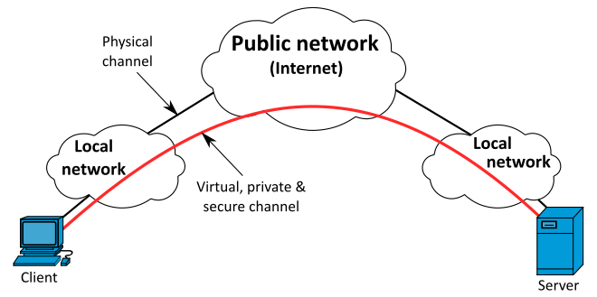
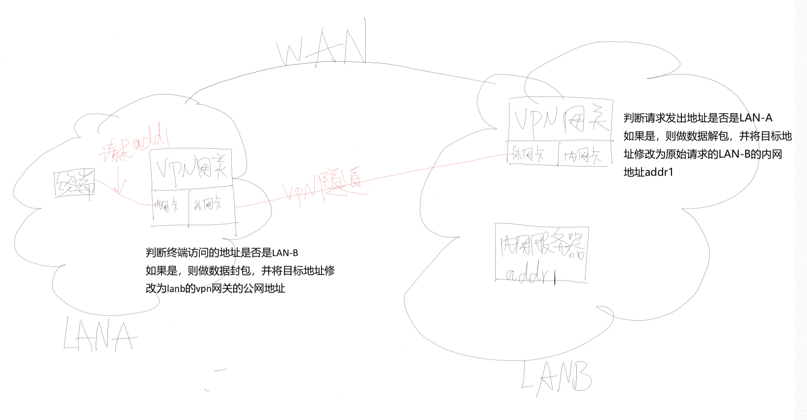
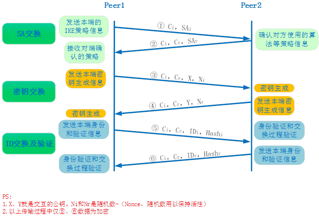
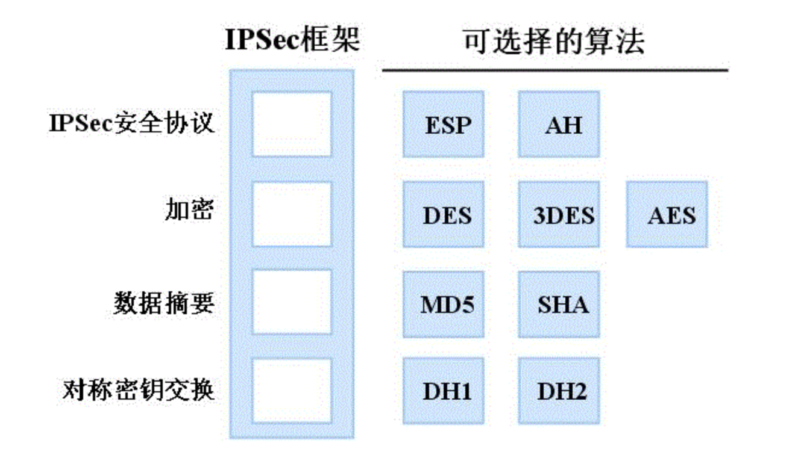
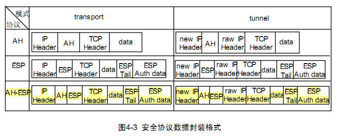
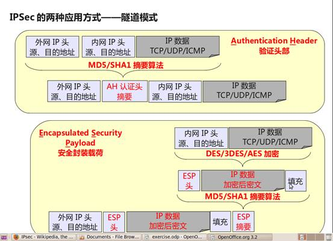
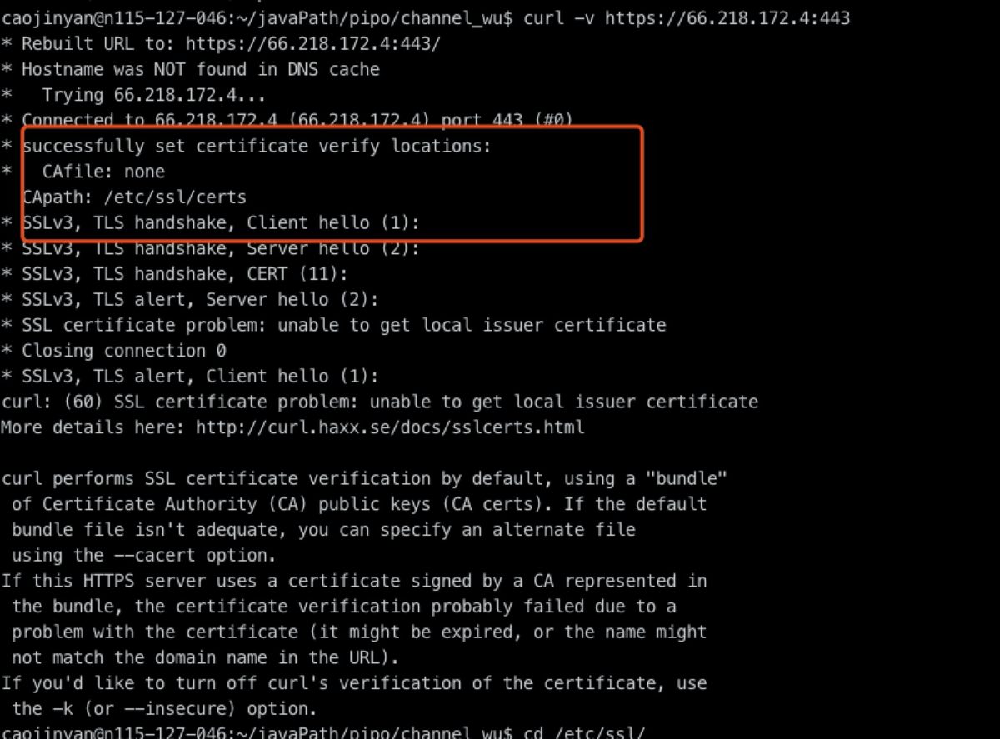

# 网络传输安全
## VPN
VPN
VPN是什么
什么是VPN?VPN解决了什么问题?适用场景是什么?有什么优缺点?

vpn 全程是Virtual private network，它通过公共网络提供了专用网络。使得用户的设备可以像在私有网络一样通过公共网络来发送和接收数据，所以叫做虚拟专用网络。

公共网络存在的问题：
请求内容被泄漏，响应被篡改，服务器被攻击等等..

相比公共网络的数据传输来说，VPN安全模型提供：
- 机密性，发送内容做加密，即使网络流量在数据包级别被嗅探，攻击者也只会看到加密的数据
- 发送方身份验证，以防止未经授权的用户访问VPN
- 消息完整性，以检测任何篡改所传输消息的实例

VPN可以帮助远程用户、公司分支机构、商业伙伴及供应商同 公司的内部网建立可信的安全连接，并保证数据的安全传输。相比专线来说，VPN的优势之处还在于它可以很好的利用当前既有的Internet线路资源，不再受地域的限制，而对于用户来讲，VPN的工作方式是完全透明的

## VPN 工作原理

VPN中包含的技术大概可以分为三类：
1. 隧道技术（tune channel）:vpn技术使得两个局域网的终端在复杂的公共网络中打通了一条隧道一样,将两个终端连接在了一起,这条虚拟的线路被称为隧道技术.
2. 数据的加解密:由于数据是在公网中传输,所以封包之后的数据会按照一定的加密算法进行加密
3. client和server的认证:vpn技术提供了对client端的身份认证

## VPN之隧道技术
隧道技术是VPN技术中一个关键的组成部分，通过隧道技术，源数据包被放入另一个数据包中，并将后者通过网络发送出去。且网络和数据包进出网络的入口点和出口点（我们称为隧道接口）都能够理解外部数据包。

VPN的隧道协议主要有三种，PPTP，L2TP和IPSec，其中PPTP和L2TP协议工作在OSI模型的第二层，又称为二层隧道协议；IPSec是第三层隧道协议，也是最常见的协议。L2TP和IPSec配合使用是目前性能最好，应用最广泛的一种。
- 点对点隧道协议PPTP〈Point to Point Tunneling Protocol〉：  
PPTP是由包括微软和3Com等公司组成的的PPTP论坛开发的点对点的隧道协议，PPTP使用传输控制协议（TCP）创建控制通道来发送控制命令，以及利用通用路由封装（GRE）通道来封装点对点协议（PPP）数据包以发送数据。
>点对点协议（PPP，Point-to-Point Protocol）主要是用来通过拨号或专线方式在两个网络节点之间建立连接、发送数据。PPP是各类型主机、网桥和路由器之间简单连接的一种解决方案
- 第二层隧道协议L2TP〈Layer Two Tunneling Protocol〉：
L2TP是一种工业标准的Internet隧道协议，功能大致和PPTP协议类似，比如同样可以对网络数据流进行加密。不过也有不同之处，比如PPTP要求网络为IP网络，L2TP要求面向数据包的点对点连接；PPTP使用单一隧道，L2TP使用多隧道；L2TP提供包头压缩、隧道验证，而PPTP不支持。
- 网络隧道安全协议IPsec〈Internet Protocol Security〉：
IPSec全称为Internet Protocol Security，是由Internet Engineering Task Force (IETF) 定义的安全标准框架，IPsec协议不是一个单独的协议，它给出了应用于IP层上网络数据安全的一整套体系结构.
## ipsecVpn的处理过程
1. 流量触发IPsec,VPN网关检查是否应该使用IPsec传输数据包。这些数据包流量会自行触发安全策略。当发送数据包的系统应用适当的加密时，将完成此操作。主机还会检查传入的数据包是否正确加密。
2. 连接管理:
- 2.1. OSAKMP/IKE 阶段一：
阶段一需要要完成三个任务：
  - 协商采用何种方式连接
  - 通过DH算法共享密钥信息　
  - 对等体之间进行身份验证
经过阶段一,一个安全的管理连接就建立起来了

> 说明:连接的管理分为两种模式,该图是主模式,另一种野蛮模式不在这里详细介绍
上述的三个任务是通过6个数据包完成的
前两个数据包用于协商对等体间的管理连接使用何种安全策略；
中间两个数据包通过DH算法产生并交换加密算法和HMAC功能所需的密钥；
最后两个数据包使用预共享密钥等方式执行对等体间的身份验证

- 2.2. ISAKMP/IKE阶段二：
SAKMP/IKE阶段2只有一个模式：快速模式.它定义了受保护数据连接是如何在两个IPSEC对等体之间构成的.快速模式有两个主要的功能：
a.协商安全参数来保护数据连接。
b.周期性的对数据连接更新密钥信息.
交互的信息包括:
安全协议：AH 协议 ESP协议
连接模式：隧道模式、传输模式
加密方式：对于ESP而言，有DES、3DES、AES-128、AES-192、AES-256或不使用加密算法
验证方式：MD5或SHA1

1. 通过新创建的IPsec加密隧道交换数据。主机使用IPsec SA对这些数据包进行加密和解密。

数据封装基于阶段1和阶段2的秘钥和数据安全连接的信息

>扩展阅读:https://blog.csdn.net/chenxz_/article/details/85220199

当主机之间的通信完成或会话超时时，通过丢弃两个主机的密钥来终止IPsec隧道。
>1. 封装安全负载（ESP）–
>它提供数据完整性，加密，身份验证和防重播。它还提供对负载(payload)的身份验证。
>2. 身份认证的消息头（AH）–
>也会提供数据完整性，身份验证和防重播，但是不会做加密。防重放保护可防止未经授权的数据包传输,但是它不保护数据的机密性

## 专线
专线是运营商为集团客户提供各种速率的专用链路，直接连接主干网络，实现方便快捷的高速互联网上网服 务。客户可以通过有线、无线的方式接入互联网，带宽可以灵活选择。专线主要有两种信道
1、物理专用信道。物理专用信道就是在服务商到用户之间铺设有一条专用的线路，线路只给用户独立使用， 其他的数据不能进入此线路，而一般的线路就允许多用户共享信道;
2、虚拟专用信道;虚拟专用信道就是在一般的信道上为用户保留一定的带宽，使用户可以独享这部分带宽， 就像在公用信道上又开了一个通道，只让相应用户使用，而且用户的数据是加密的，以此来保证可靠性与安 全性;

专线需要和数据运营商申请,在阿里云的申请页面介绍中,申请完成后会分配几个固定的ip地址.为了解决ip地址分配的问题,会需要使用NAT做网络地址转换.
NAT(Network Address Translation，网络地址转换)是1994年提出的。当在专用网内部的一些主机本来已 经分配到了本地IP地址(即仅在本专用网内使用的专用地址)，但现在又想和因特网上的主机通信(并不需 要加密)时，可使用NAT方法。
这种方法需要在专用网连接到因特网的路由器上安装NAT软件。装有NAT软件的路由器叫做NAT路由器，它至少有一个有效的外部全球IP地址。这样，所有使用本地地址的主机在和外界通信时，都要在NAT路由器上将其本地地址转换成全球IP地址，才能和因特网连接。
另外，这种通过使用少量的公有IP 地址代表较多的私有IP 地址的方式，将有助于减缓可用的IP地 址空间的枯竭
NAT不仅能解决IP地址不足的问题，而且还能够有效地避免来自网络外部的攻击，隐藏并保护网络内部的计算机。
1.宽带分享:这是 NAT 主机的最大功能。
2.安全防护:NAT 之内的 PC 联机到 Internet 上面时，他所显示的 IP 是 NAT 主机的公共 IP，所以 Client 端 的 PC 当然就具有一定程度的安全了，外界在进行 portscan(端口扫描) 的时候，就侦测不到源Client 端的 PC 。

## 自建证书
CA是数字证书管理机构，而SSL证书只是数字证书的一种，CA机构签发SSL证书，所以说，SSL是CA颁发的证书中的一种。所以，从理论上来说，如果服务端采用https协议，而自己没有ssl证书(服务端不提供ssl证书)，那么通信是不可能成功的。

所以，这里有两个解决思路: 
1、确认是单向认证还是双向认证，Server端是否校验Client端(存在这种情况，服务端虽采用https协议，但并不校验CA证书，如果需要校验，那服务端至少得提供秘钥).对于单向认证,只对server端的证书做认证,所以在访问https站点前,需要首先把server端证书安装到本地. 
2、可以忽略服务器证书校验(将hostname校验和CA证书校验同时关闭)网上最常用的，就是利用jdk生成keyStore文件，该方法忽略服务器证书校验的方法
> 在直接请求时,在https三次握手时会出现错误,在java应用中提示握手错误,通过curl请求,发现无法获取到服务端证书.测试环境下,可以绕过ssl认证阶段,不做服务端的证书验证过程.
> 
> 单向认证和双向认证:https://blog.csdn.net/qq_25406669/article/details/80596664 双向认证保证了只有特定的客户端才能访问服务端,适合一些企业级的访问

## 网络传输
目前我们接触到了为了保证数据传输所做的一些措施
加签验签:业务逻辑层面,做数据认证,保证数据的完整性
https:单向认证只能由client对服务端做验证,服务端对客户端做认证:ip白名单、appkey等(可能伪造，由业务做预防).双向认证,作用在tcp层之上,做数据认证和加密
vpn:作用在ip层或者传输层,保证数据的完整性,安全性,认证
专线:作用在传输层,保证数据的完整性,安全性,认证

综合来看,我们在网络传输中需要考虑的:
client和server的认证
数据的完整性
数据的保密性

| \               | client认证 | server认证 | data完整性 | data保密性 | OSI模型层级              |
| --------------- | ---------- | ---------- | ----------- | ---------- | ------------------------ |
| https(单向认证) | N         | Y          | Y           | Y          | 传输层 (tcp)             |
| https(双向认证) | N         | Y          | Y           | Y          | 传输层 (tcp)             |
| vpn             | Y          | Y          | Y           | Y          | 网络层(ip)   /数据链路层 |
| 专线            | Y          | Y          | Y           | Y          | 数据链路层               |
| 加签验签        | Y          | Y          | Y           | N          | 应用层                   |

扩展阅读:
https://wenku.baidu.com/view/956fc70eb94ae45c3b3567ec102de2bd9605de88.html
https://www.geeksforgeeks.org/ip-security-ipsec/
http://www.kokojia.com/article/28452.html
http://www.h3c.com/cn/d_201005/675214_97665_0.htm
https://blog.csdn.net/chenxz_/article/details/85220199